# Ethical Hackers Italiani Contest #1

## The complete Write-Up

###### `Introduction`

Some days ago, my friend [Pierpaolo Palmisano](https://www.linkedin.com/in/pierpaolo-palmisano-27ab0b8b/) tagged me on a Ethical Hacker Italiani group post. This post prometed the first group contest mades by [Alessandro Vannini](https://www.linkedin.com/in/avannini/) and [Eugenio Fontana](https://www.linkedin.com/in/eugeniofontana/).

###### `Contest  Disclaimer`

No disclaimer was present. The only file given from the organiser was `Contest_27Marzo.zip`; was an open contest.

###### `Technical Write-Up`

First, I extracted the zip file and I found 9 files, 4 images, 2 pcap files, 2 text files and finally 1 file without extension. I started the contest by analyzing the image files.

###### `Image analysis`

Tipically, the images can contains data using 3 techniques: , `exif`, `image manipulation`and `steganography`.

`Exif`, aka Exchangeable image file format, is a standard that specifies the formats for images, sound, and ancillary tags used by digital cameras (including smartphones), scanners and other systems handling image and sound files recorded by digital cameras. Sometimes, the contest organiser insert a custom tag to hide useful data to complete the challenge.

To extract all exif tags I used `exiftool` from Kali and I found this:

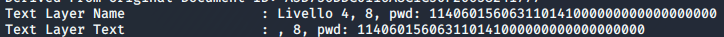

that converted from octal base is: `L0n3Ha`

Completed the exif tag extraction, I analyzed the image manipulation. To complete this task I used the `ELA` techniques. `ELA`, aka Error Level Analysis, is the analysis of compression artifacts in digital data with lossy compression such as JPEG. 

ELA showed me a manipulated section on the `data3.jpg` image file.

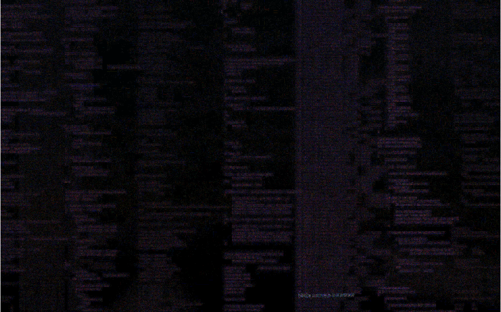

that converted from hexadecimal base is: `L0n3Hack3R1!`

Completed the ELA analysis, I analyzed the steganography information hiding. `Steganography` is the practice of concealing a file, message, image, or video within another file, message, image, or video.

The only solution, to accomplish,  is find the original image and compare it with the given from the challenge.

I used the `Google Image Search Engine` and `TinEye` services to search the original images and I found this:

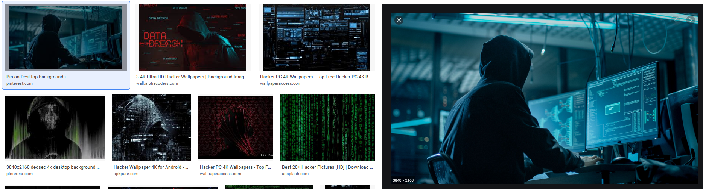

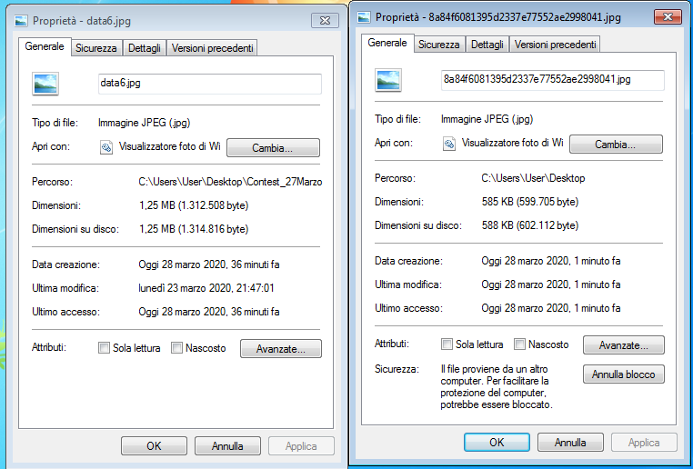

As it possible to see, the image size is different with same resolution, color deph and compression. `The data6.jpg file contains another file`

I tried to extract this file using `steghide` with the `L0n3Hack3R1!` password but nothing. Steghide uses another algorithm to hide the information.

###### `SPG file analysis`

This is the file without extension. Before to open it, I saw the content with an Hex editor like `HxD`

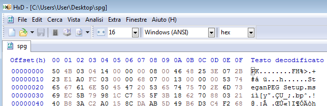

The first two bytes `0x50,0x4B` indicates that it is a zipped files, than, I added the extension `.zip` and I extracted its content. 

This zip package contained the setup of an Steganography tool named `SteganPEG`.

With the software installed, I tried to extracted the hiding information using the `L0n3Hack3R1!` password. The steganography software has extracted a xlsx file.

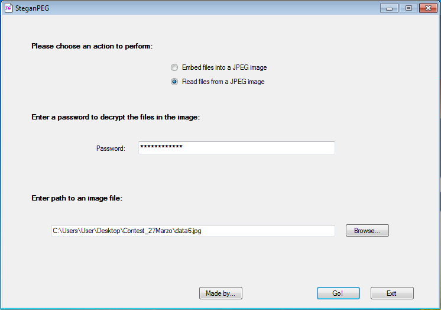

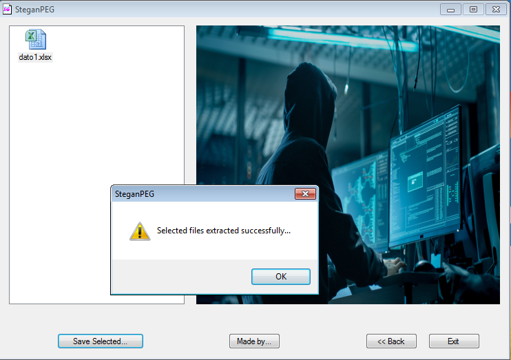

###### `Excel file analysis`

I tried to open the new file, but, it requested me a password. I tried to insert the passwords that I collected with before steps but nothing.

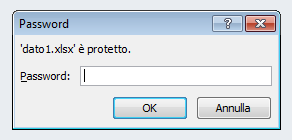

To unlock the SpreadSheet I used a web service called `lostmypass.com`. `REMEMBER! This is a contest! Never upload business document on this type of services`

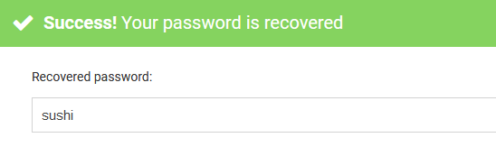

The excel password was: `sushi`

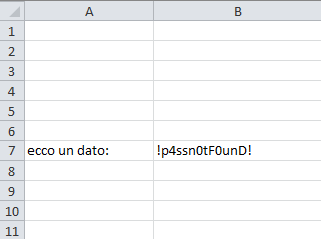

Inside the spreadsheet I found another password: `!p4ssn0tF0unD!`

###### `PCAP file analysis`

The `Contest_27Marzo.zip` file contained also two pcap files. The `pcap` contains network packet data created during a live network capture; used for "packet sniffing" and analyzing data network characteristics; can be analyzed using software that includes the libpcap or WinPcap libraries.

Using Wireshark, I used the `Conversation` Statistics feature to order the remote host communication.

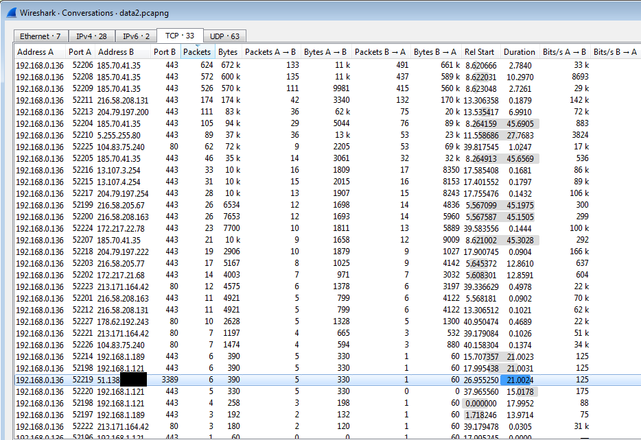

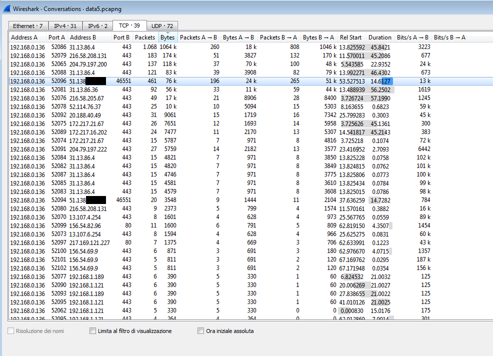

As it possible to see, there is a remote IP(parially masked) that communicates over `3389` TCP port and after over the `46551` TCP port. The 3389 port number indicates, tipically, for RDP service.

Using nmap, I enumerated the service that listen on the port 46551, and I found that the RDP service on the remote server was listen on this port and not on the 3389 port. Probably, the port was modify.

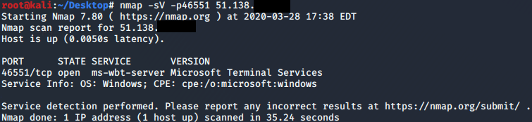

###### `Text file analysis`

The `Contest_27Marzo.zip` file contained two text file, `data7.txt` that contained a MD5 hash and `data8.txt` that was a dictionary file.

The `4f778f29f5fba0c17ac619ed37abf728` hash correponded to `hack1\HaCK!ngCont3st` string. 

###### `Testing the RDP`

Obtained all of possible evidences, I tried the RDP connection to remote server using the `hack1\HaCK!ngCont3st` as username and `!p4ssn0tF0unD!` as password.

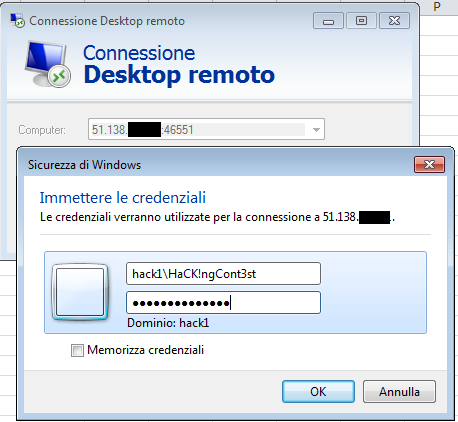

and... `I'm logged in!`

On the desktop I found a text file named `dato4.txt` that contains a remote connection username to a FTP server.

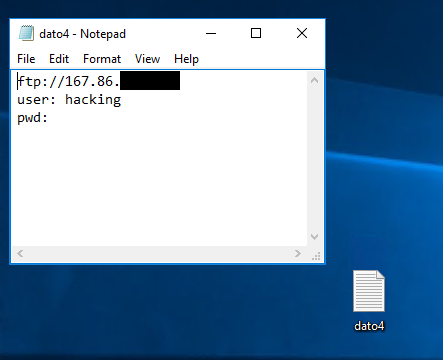

###### `Testing the FTP`

With the `data8.txt` dictionary, I bruteforced the login password using hydra.

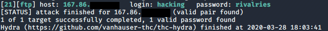

and I obtained the `rivalries` password.

Obtained the password, I tried to connect to FTP using `hacking` as username and `rivalries` as password.

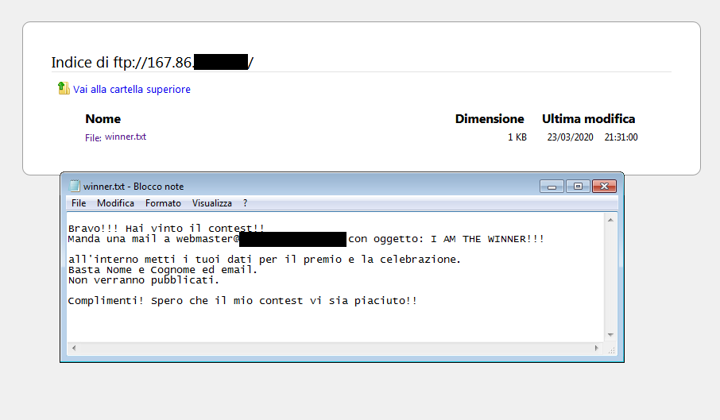

###### `Certificate`

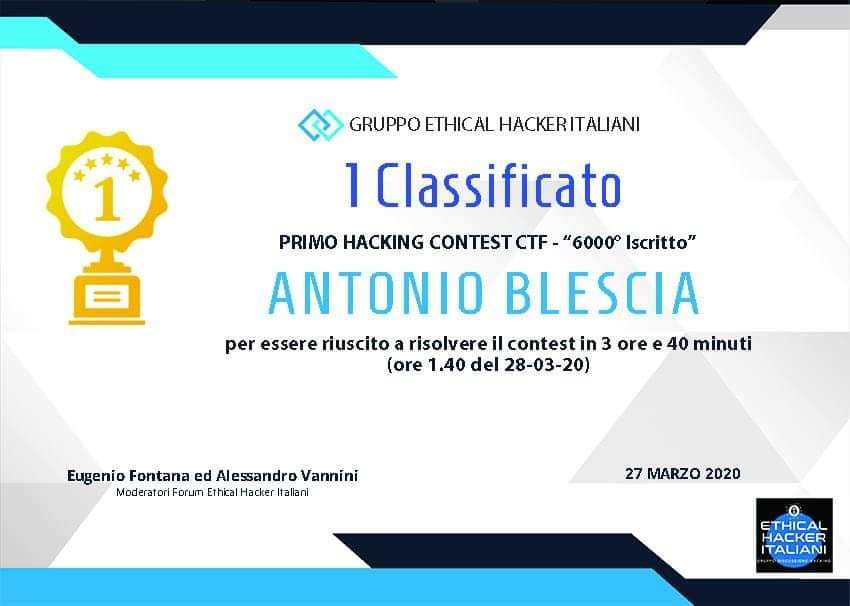
