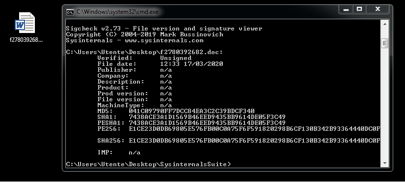
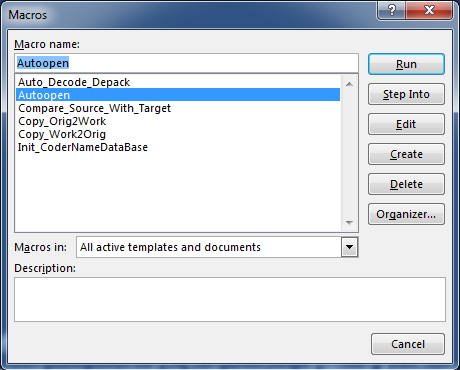
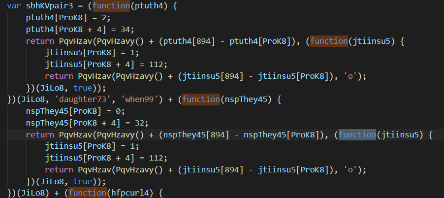
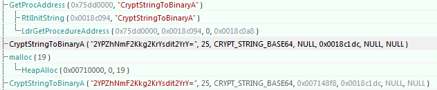
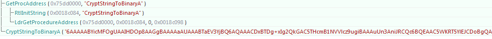
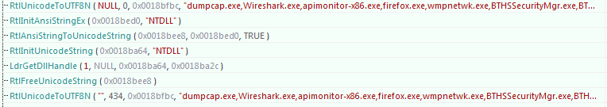

# Covid19 Malware Reverse

## Another way to spread Trickbot by taking advantage of the italian situation

###### `Threat Attack Map`

:::{#container .map-container}

:::{#attackdiv .map-visualize--details-container}
:::

:::
	
###### `Introduction`

**As a very Italian(🇮🇹) responsible person, I'm in self quarantine at the moment**; my country is really struggling with Covid-19 and our President told us to stay at home.

After my last [article](https://medium.com/@antonioblescia/coronavirussafetymeasures-pdf-exe-d14e977bf415) about the reverse engineering of the other Covid19 fake pdf, I decided to reverse another attack that uses a doc to spread a famous malware called **Trickbot**

By Googling I found a lot of articles that talk about an email received from a fake `Dott.sa Penelope Marchetti` that writes from OMS:

Honestly, the email is written with a wonderful Italian language, this means that the attackers are very interested in targeting Italy by abusing its emergency.

###### `Technical Description`

As next step I need to retrieve the doc sample that is attached to the email; after some search I found it on any.run by using a Google Dork: `"f16744643424.doc" site:any.run`. 

Once downloaded the sample I analyzed it with [Reaqta](https://reaqta.com/)

As it is possible to see, the document, first creates the folder `C:\MyImages` and puts in it two files, `presskey.cmd` and `presskey.jse`, after runs a cmd.exe session that runs a cscript process as its child. To spawn the process the VBA code doesn't drop any code from the Internet, then, the payloads are stored inside the Macros.

To show the macro's source code, I reopened the doc file, then I clicked on `View->View Macro`

With the macro list, I tried to open the `AutoOpen` macro to see its source code, but.....

Word requested me a password! To bypass the protection I changed the DPB parameters declared inside the `VBAProject.bin` file and unlock the macro protection.

As I said before, the source code of the two files inside the `MyImages` folder was declared inside the Macro, in fact, I saw it inside the `maximepixsc` macro function

Once obtained the macro source code I passed to analyze the two files inside the `MyImages` folder. The first file, `presskey.cmd` is used only to run `cscript.exe` by passing the `presskey.jse` file as argument. This file is very obfuscated and its structure rembembers me a classic Trickbot dropper.

The script has the most common anti-analysis tricks: obfuscation, anonymous functions, dynamic sleeps, and so on.

When I saw the session on any.run I didn't see any communication with external servers. This is a common sandbox evasion implementation to make impossible a dynamic analysis on free malware hunting platforms.

For this reason I decided to debug the code on my physical machine with Visual Studio 2019. To debug a **js Windows Host Script** it is necessary to configure the VS with the external debug tool(I will write a brief article to achieve this goal).

After the Visual Studio configuration step, I renamed the extension file from `*.jse` to `*.js` and I lunched the `cscript.exe //X keypress.js` command.

With the debug attached to cscript instance, I declared different global variables to follow the code execution step by step. The attacker delays the infection step by using a while condition with a dynamic threshold value.

To accelerate the infection process, I modified the variable `sbhKVhome66` value to make true the if condition and I saw that the script made a different environment check, like the installed Hard Drives

After the checks, the script contacted the backend to download the Trickbot malware

###### `Update`

After some days of observation I saw an unusual chain infection. Typically an infected document drops `Emotet` to creates the persistence and, after, `Emotet` drops `Trickbot` to steal sensitive data.

In this infection, the situation is inverted, `Trickbot` drops `Emotet`. The attackers, probably, have as first goal steal sensitive information and after sell the access on the dark web.

Tipically, this type of infection chain leads to a ransomware infection like `Ryuk`

Once started the `Emotet` infection, I ran `Wireshark` to capture the http request sent to `Emotet` C2. Every request is sent using clear `HTTP` without the `TLS` support, but, the request body is encrypted. 

With the encrypted body, I decided to debug the obfuscated `Emotet` code by hooking the Win32 Api to see what type of data are sent to the C2.

The hooking techniques consists of inject a custom `dll` inside a process. This dll contains a code that intercept all of user-space calls module and print the passed parameter by the process.

Below what I found by hooking the `Emotet` process.

Emotet, first, requests to the Windows `CSP` (Cryptography Service Provider) the key pair

Loads the symmetric key with `base64` encoding;

After, loads the asymmetric public key used to encrypt the communication with the C2.

Enumerates the running processes, probably to detect if the running environment is a Virtual Machine.

Encrypts the processes list payload with CryptEncrypt Win32 Api

Sends the encrypted payload to the C2 by encapsulating it inside an HTTP request

Finally, receives the response from the `Emotet` C2.

###### `Conclusion`

The `thread map`, on top of this article, shows the real connections made during the process infection(from the document to Emotet)

I think that this is a classic type of infection, as I said before, that leads to a ransomware attack.

###### `IoC`

You can find [here](https://gist.github.com/nocommentlab/d9d815ecfd88fb1e487948c318d5b435) the extracted IoC.

