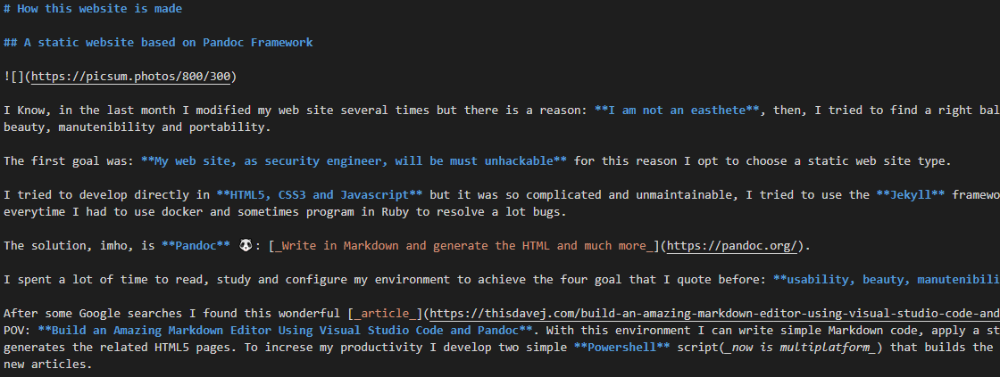
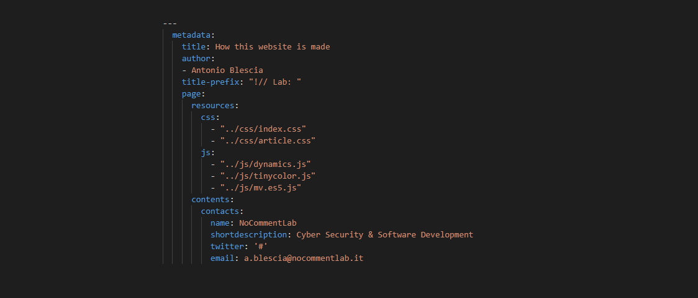

# How this website is made

## A static website based on Pandoc Framework

I know, in the last month I've edited my web site several times but there is a reason: **I am not an aesthete**, then, I've tried to find a right balance between usability, beauty, maintainability and portability.

The first goal was: **My web site, that of a security engineer, shall be unhackable** for this reason I've opted for a static web site type. 

I tried to develop directly in **HTML5, CSS3 and Javascript** but it was so complicated and unmaintainable, then I tried to use the **Jekyll** framework but it was so tricky, every time I had to use docker and sometimes program in Ruby to resolve a lot of bugs. 

The solution, IMHO, is **Pandoc** 🐼: [_Write in Markdown and generate the HTML and much more_](https://pandoc.org/).

I spent a lot of time reading, studying and configuring my environment to achieve the four goals I mentioned before: **usability, beauty, maintainability and portability**. 

After some Google searches I found this wonderful [_article_](https://thisdavej.com/build-an-amazing-markdown-editor-using-visual-studio-code-and-pandoc/) that opened my POV: **Build an Amazing Markdown Editor Using Visual Studio Code and Pandoc**. 

With this environment I can write simple Markdown codes, apply a static template and generate the related HTML5 pages. To increase my productivity I've developed two simple **Powershell** scripts(_now is multiplatform_) that build the entire blog and create new articles.

Special thanks to [Vito Nicola Galluzzi](https://www.linkedin.com/in/nicolagalluzzi/) and [Angela Caporale](https://www.linkedin.com/in/angelacaporale/), they convinced me to change my horrible old website.

